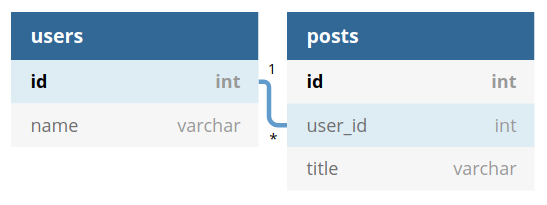
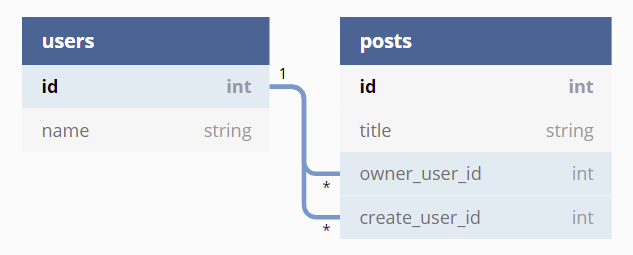

# Models

In this chapter, we are going to explain all details about models. There are so many things that we can say, and we are going to. Let's begin!
**In Axe API, models are not well-known ORM models.**

## What Is Model?

**Model** is the heart of the **Axe API**. There are many things you can do with Models. By adding and changing some configurations, you can decide how the API should work.

Some of the model definitions will be used only in the booting process, some of them are in the HTTP handling process. But don't worry, we are going to explain everything with many examples.

## Structure

A model is basically a class that is extended from Model Class. The following example shows the basic model;

```ts
import { Model } from "axe-api";

class User extends Model {}

export default User;
```

Let's talk about what happens if you define a model like this. Don't think this is a useless model for your API. After you save it, Axe API will analyze the model and will create routes automatically. In this example, the following routes will be ready to use;

| HTTP Method | Url             | Behavior              |
| ----------- | --------------- | --------------------- |
| GET         | `api/users`     | Paginate all users    |
| POST        | `api/users`     | Create a new user     |
| GET         | `api/users/:id` | Get the user by id    |
| PUT         | `api/users/:id` | Update the user by id |
| DELETE      | `api/users/:id` | Delete the user by id |

By adding more getter and functions, you can tell a different story about your API.

:::tip
If you send the following request in your local development environment, you will see the API will respond;
<a href="http://localhost:3000/api/users" target="_blank" rel="noreferrer">localhost:3000/api/users</a>
:::

## Table Name

With this getter, you can define which name is using in the database table.

By default, you don't have to put any table name definition. But again, you may set your table name with `table` getter. If you don't set a `table` getter, we will use the Model name as the table name. But there are only one difference; the table name will be converted to plural if your model name is singular.

```ts
import { Model } from "axe-api";

class User extends Model {
  get table(): string {
    return "users";
  }
}

export default User;
```

:::tip
We strongly suggest that to use singular model names in general.
:::

## Primary Key

With this getter, you can define the name of the primary key in the database.

The primary key value is `id` by default. Nevertheless, you may change it as you wish by your model definition, like the following code example;

```ts
import { Model } from "axe-api";

class User extends Model {
  get primaryKey(): string {
    return "uuid";
  }
}

export default User;
```

## Fillable Fields

By default, we don't allow the user to send any data to create or update a record, because of security issues. If you want to allow what kind of data can be filled, you should use `fillable` getter in your model.

```ts
import { Model } from "axe-api";

class Users extends Model {
  get fillable(): string[] {
    return ["email", "name", "surname", "age"];
  }
}

export default User;
```

In this example, **email**, **name**, **surname** and **age** columns can be editable by users in **CREATE** and **UPDATE** handlers. If you have a field like **my_secret** and you don't want to make it fillable by users, you **shouldn't** add it to this array. Then it will be safe and only editable by yourself.

On the other hand, you can decide different fillable column list by the HTTP method type. For example, usually, we don't want to change the email in the profile update request because it takes too many actions such as sending a confirmation email.

```ts
import { Model, IMethodBaseConfig, HttpMethods } from "axe-api";

class Users extends Model {
  get fillable(): IMethodBaseConfig {
    return {
      [HttpMethods.POST]: ["email", "name", "surname", "age"],
      [HttpMethods.PUT]: ["name", "surname", "age"],
    };
  }
}

export default User;
```

Like the code above, changing **email** has more complex logic because of security. So you may not want to make it editable in update actions.

## Validations

Everybody needs to form validation in their API. Axe API uses <a href="https://www.npmjs.com/package/validatorjs" target="_blank" rel="noreferrer">validatorjs</a> internally.

The thing you should do to define validations is adding a validation method to your model. The validation method should return an object which describes how form validation should be.

```ts
import { Model } from "axe-api";

class Users extends Model {
  get validations(): Record<string, string> {
    return {
      email: "required|email",
      name: "required|max:50",
      surname: "required|max:50",
      age: "max:100",
    };
  }
}

export default User;
```

This form validation method will be triggered before **CREATE** and **UPDATE** handlers.

On the other hand, if you want to use different validation rules in **creating** and **updating** a model record, you can use following structure;

```ts
import { Model, IMethodBaseValidations, HttpMethods } from "axe-api";

class Users extends Model {
  get validations(): IMethodBaseValidations {
    return {
      [HttpMethods.POST]: {
        email: "required|email",
        name: "required|max:50",
      },
      [HttpMethods.PUT]: {
        name: "required|max:50",
      },
    };
  }
}

export default User;
```

If the form data doesn't provide validation rules, Axe API will respond as a validation error like this;

```json
{
  "errors": {
    "email": ["The email field is required."],
    "name": ["The name field is required."]
  }
}
```

:::tip
HTTP status code will be 400 (Bad Request) in that HTTP response.
:::

## Hidden Fields

You may want to hide some columns in your API results when you have some sensitive information such as password hash. In this case, you should use the following getters to define which columns will be hide;

```ts
import { Model } from "axe-api";

class User extends Model {
  get hiddens(): string[] {
    return ["password", "password_hash"];
  }
}

export default User;
```

:::tip
This definition will be used for all queries, even recursive queries too. You can check the **Queries** section to learn more about queries.
:::

## Serialization

You can use a serialize function in your model definition to hide some values or to create some computed results.

```ts
import { Request } from "express";
import { Model } from "axe-api";

class User extends Model {
  serialize(item: any, request: Request) {
    return {
      ...item,
      fullname: `${item.name} ${item.surname}`,
    };
  }
}

export default User;
```

:::tip
As you can see, there is the `request` object as the second argument. You can use the `request` object to filter data. For example; you can hide some data from the user by some authorization rules.
:::

The serialization function will be triggered automatically by all handlers. Also, recursive queries are supported. In this method, you can manipulate all results by your model.

```json
{
  "id": 1,
  "name": "Karl",
  "surname": "Popper",
  "fullname": "Karl Popper"
}
```

## Timestamps

Axe API supports timestamps as default. While you are creating a new database table in your migrations, you can add timestamps with the <a href="http://knexjs.org/#Schema-timestamps" target="_blank" rel="noreferrer">Knex.js helpers</a>. After that, you don't have to do anything. Axe API will manage your timestamps automatically.

You can look at the simple timestamp example for a migration file;

```ts
export const up = function (knex) {
  return knex.schema.createTable("users", function (table) {
    table.increments();
    table.string("email").unique();
    table.timestamps();
  });
};
```

Axe API use `created_at` and `updated_at` columns as default column name. But you can change it and use your naming structure. To do that, you should add the following getters in your model;

```ts
import { Model } from "axe-api";

class User extends Model {
  get createdAtColumn(): string {
    return "my_created_at";
  }

  get updatedAtColumn(): string {
    return "my_updated_at";
  }
}

export default User;
```

If you don't want to use timestamps in a model, you have to return NULL in your timestamp naming getters.

```ts
import { Model } from "axe-api";

class User extends Model {
  get createdAtColumn(): null {
    return null;
  }

  get updatedAtColumn(): null {
    return null;
  }
}

export default User;
```

## Soft Delete

A soft delete marks a record as no longer active or valid without actually deleting it from the database. Soft deletes can improve performance, and can allow “deleted” data to be recovered.

You must define which table column will be used as soft-delete column to keep deletion date;

```js
class Customer extends Model {
  get deletedAtColumn() {
    return "deleted_at";
  }
}

export default Customer;
```

:::warning
Your database table must have `deleted_at` column. The data type must be `DATETIME` and the field should be `nullabe`.

This is a simple migration example you can use;

```js
export const up = function (knex) {
  return knex.schema.createTable("customers", function (table) {
    table.increments();
    table.string("name");
    table.datetime("deleted_at").nullable();
    table.timestamps();
  });
};
```

:::

You can use soft delete feature after this configurations.

:::tip
You can use [FORCE_DELETE](/basics/handlers.html#force-delete) handler if you want to delete a record completelty.
:::

:::tip
Soft-deleted records are not listed in the results. It is the same for related models, too.
:::

## Handlers

Now we can talk about the routing features of models.

As default, all CRUD routes will be generated for a model definition. But, you can decide what route should be generated for the model with the following definition.

```ts
import { Model, HandlerTypes } from "axe-api";
const { INSERT, SHOW, UPDATE, PAGINATE } = HandlerTypes;

class User extends Model {
  get handlers(): HandlerTypes[] {
    return [INSERT, PAGINATE];
  }
}

export default User;
```

With handlers getter, you can select what kind of behavior will be activated for the model. The code above allows only insert and pagination. With this definition, you will get the following routes only;

| HTTP Method | Url         | Handler  | Behavior               |
| ----------- | ----------- | -------- | ---------------------- |
| GET         | `api/users` | PAGINATE | Paginating all records |
| POST        | `api/users` | INSERT   | Creating a new record  |

**Handlers** mean what behaviors have does the model. There are very different handlers that models can support. But also, there are many on the roadmap. You can review our the following handlers table;

- `INSERT`: Creating a new record.
- `PAGINATE`: Paginating the all record.
- `SHOW`: Showing one record by id parameter.
- `UPDATE`: Updating the record by id parameter.
- `DELETE`: Deleting the record by id parameter.

## Related Routes

By best practices, usually, we build related paths for models. For example, let's assume we have two tables; `users` and `posts` and these tables are related like the following schema;

<div style="text-align:center;">



</div>

In this case, we need routes like this;

| HTTP Method | Url                           |
| ----------- | ----------------------------- |
| GET         | `api/users`                   |
| POST        | `api/users`                   |
| GET         | `api/users/:id`               |
| PUT         | `api/users/:id`               |
| DELETE      | `api/users/:id`               |
| GET         | `api/users/:userId/posts`     |
| POST        | `api/users/:userId/posts`     |
| GET         | `api/users/:userId/posts/:id` |
| PUT         | `api/users/:userId/posts/:id` |
| DELETE      | `api/users/:userId/posts/:id` |

Creating routes in **Axe API** like these is very simple. There is only one thing we should do; **defining relationship** between models. For this case, we should have the following model definitions;

For `app/Models/User.ts` model file;

```ts
import { Model, IRelation } from "axe-api";

class User extends Model {
  posts(): IRelation {
    return this.hasMany("Post", "id", "user_id");
  }
}

export default User;
```

For `app/Models/Post.ts` model file;

```ts
import { Model, IRelation } from "axe-api";

class Post extends Model {
  user(): IRelation {
    return this.belongsTo("User", "user_id", "id");
  }
}

export default Post;
```

The following routes will be created **automatically** when you create a model definition like this.

- `GET api/users`
- `POST api/users`
- `GET api/users/:id`
- `PUT api/users/:id`
- `DELETE api/users/:id`
- `GET api/users/:usedId/posts`
- `POST api/users/:usedId/posts`
- `GET api/users/:usedId/posts/:id`
- `PUT api/users/:usedId/posts/:id`
- `DELETE api/users/:usedId/posts/:id`

:::tip
Literally, you don't need to manage foreign key values in the HTTP requests. Because Axe API knows the relation very well, and it will manage it for you.
:::

## Nested Routes

Axe API tracks all of your models. If you define a relationship between multiple models, it will create all related routes. Let's assume you have three models like; User, Post, and Comment. In this case, you will have the following route pattern;

`api/users/:userId/posts/:postId/comments/:id`

Once you define all the relationships between these three models, you will have all related routes.

:::tip
Of course, you will not have only one route. If you use default handlers, you will have 15 routes with that kind of relationship.
:::

## Multiple Relation

In some cases, you need to define multiple relationships to the same table at the same time. Axe API supports this feature. Here, we are going to show you a simple example.

Let's assume you have a database schema like this;

<div style="text-align:center;">



</div>

In this case, you have a relationship to a table with two different foreign keys.

For `app/Models/User.ts` model file;

```ts
import { Model, IRelation } from "axe-api";

class User extends Model {
  ownedPosts(): IRelation {
    return this.hasMany("Post", "id", "owner_user_id");
  }

  createdPosts(): IRelation {
    return this.hasMany("Post", "id", "create_user_id");
  }
}

export default User;
```

For `app/Models/Post.ts` model file;

```ts
import { Model, IRelation } from "axe-api";

class Post extends Model {
  owner(): IRelation {
    return this.belongsTo("User", "owner_user_id", "id");
  }

  creator(): IRelation {
    return this.belongsTo("User", "create_user_id", "id");
  }
}

export default Post;
```

In this case, you will have the following route schema;

| Url                                   |
| ------------------------------------- |
| `api/users/:id`                       |
| `api/users/:userId/owned-posts/:id`   |
| `api/users/:userId/created-posts/:id` |

:::warning
As you can see, your relation method name is used as a URL path by Axe API.
:::

:::tip
Again, these are just a demonstration. In this definition, you will have 15 routes.
:::

## Recursive Routes

Creating a recursive model is very simple with Axe API. Just add the following relationship structure and it is done! You can use a recursive resource in this way.

```ts
import { Model, IRelation } from "axe-api";

class Category extends Model {
  categories(): IRelation {
    return this.hasMany("Category", "id", "parent_id");
  }

  category(): IRelation {
    return this.belongsTo("Category", "parent_id", "id");
  }
}
```

When you define a recursive resource like this, you will have the following routes to access the resource;

| HTTP Method | Route                                     |
| ----------- | ----------------------------------------- |
| GET         | `api/categories`                          |
| GET         | `api/categories/:id`                      |
| POST        | `api/categories`                          |
| PUT         | `api/categories/:id`                      |
| DELETE      | `api/categories/:id`                      |
| GET         | `api/categories/:parentId/categories`     |
| GET         | `api/categories/:parentId/categories/:id` |
| POST        | `api/categories/:parentId/categories`     |
| PUT         | `api/categories/:parentId/categories/:id` |
| DELETE      | `api/categories/:parentId/categories/:id` |

:::warning
There is a very important point about recursive routes. If you defined a self-recursive relationship with the model itself, it totally works. But, if you created a recursive relationship between multiple models (such as; A -> B -> C -> A), we don't have anything to detect it for now.
:::

## Middlewares

Sometimes, you may want to protect your models by requests. In those cases, you can use model-based middleware. We are expecting you to define basically an <a href="https://expressjs.com/en/guide/writing-middleware.html" target="_blank" rel="noreferrer">Express Middleware</a>. To do add a middleware to a model handlers, you should use `middlewares` getter like the following code;

```ts
import { Request, Response, NextFunction } from "express";
import { Model, IHandlerBaseMiddleware } from "axe-api";

class User extends Model {
  get middlewares(): ((
    req: Request,
    res: Response,
    next: NextFunction
  ) => void)[] {
    return [
      (req: Request, res: Response, next: NextFunction) => {
        // Check anything you want here.
        next();
      },
    ];
  }
}

export default User;
```

As you can see, you should return an array. It has been designed like that because it helps us to add multiple middlewares at the same time. With the code above, your middleware list will be executed in orderly for all allowed handlers.

Of course, you can use multiple middleware functions from other files;

```ts
import { Model } from "axe-api";
import { isAdmin, isLogged } from "./../Middlewares/index";

class User extends Model {
  get middlewares(): ((
    req: Request,
    res: Response,
    next: NextFunction
  ) => void)[] {
    return [isLogged, isAdmin];
  }
}

export default User;
```

But that is not enough for us. We aimed to create a very flexible structure for you. That's why, we added a feature that you can add a special middleware function for a special handler.

```ts
import { Model, HandlerTypes, IHandlerBaseMiddleware } from "axe-api";
import { isAdmin, isLogged } from "./../Middlewares/index";
const { INSERT, PAGINATE, UPDATE, DELETE } = HandlerTypes;

class User extends Model {
  get middlewares(): IHandlerBaseMiddleware[] {
    return [
      {
        handler: [INSERT, PAGINATE, UPDATE],
        middleware: isLogged,
      },
      {
        handler: DELETE,
        middleware: isAdmin,
      },
    ];
  }
}

export default User;
```

In this example, this second middleware will be executed only for **DELETE** handler. This is a great way to create a very flexible architecture. Also, it helps us to separate common API logic (CRUD) from business logic.

## Ignore

In case you don't want to create routes for a model, Axe API provides ignore getter. Using the ignore getter you can block the model for auto-route creation. By default, ignore getter returns false. But you can change the value like the following code;

```ts
import { Model } from "axe-api";

class User extends Model {
  get ignore(): boolean {
    return true;
  }
}

export default User;
```

With this configuration, `User` model's routes wouldn't be created automatically.
