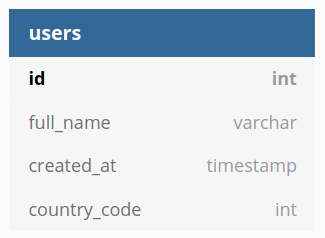

# DB Analyzer

**Axe API** comes with a strong feature which you can not find in common frameworks; **Database Analyzer (DB Analyzer)**. _DB Analyzer_ is an internal feature which analyzes your database schema deeply, and compare it with your model and query definitions. It helps you to develop an API easy and reduces critical mistakes, specially on the refactoring time.

## How It Works?

For example; let's assume that you have a model definition like the following image;

<div style="text-align:center;">



</div>

If you create a model file like the following one, even though you have a table in your database like that, you would got an error from DB Analyzer.

```ts
import { Model } from "axe-api";

class User extends Model {
  get table(): string {
    return "my_user";
  }
}

export default User;
```

If you define the table name as `my_user`, DB Analyzer wouldn't find the table in your database schema. In this case, you would get the following error;

> Error: The "my_users" table doesn't have any column. Are you sure about the table name?

This is the power of DB Analyzer.

## Protections

In the following list, you may see that which definitions are working with DB Analyzer together.

- [Table name](/basics/models/index.html#table-name)
- [Primary Key](/basics/models/index.html#primary-key)
- [Fillable Fields](/basics/models/index.html#fillable-fields)
- [Form Validations](/basics/models/index.html#validations)
- [Hidden Fields](/basics/models/index.html#hidden-fields)
- [Timestamps](/basics/models/index.html#timestamps)
- [INSERT, UPDATE actions](/basics/handlers/index.html)
- [Related Routes](/basics/models/index.html#related-routes)
- [Query Fields](/basics/queries/index.html#fields)
- [Query Sorting](/basics/queries/index.html#sorting)
- [Query Where Conditions](/basics/queries/index.html#where-conditions)
- [Query Relations](/basics/queries/index.html#related-data)

## Supported Database

Currently, <a href="https://github.com/knex/knex-schema-inspector" target="_blank" rel="noreferrer">knex-schema-inspector</a> package is using to detect columns. Axe API supports all database that has been supported by **knex-schema-inspector**.

- [x] MySQL
- [x] PostgreSQL
- [x] MSSQL
- [x] SQLite
- [x] Oracle
