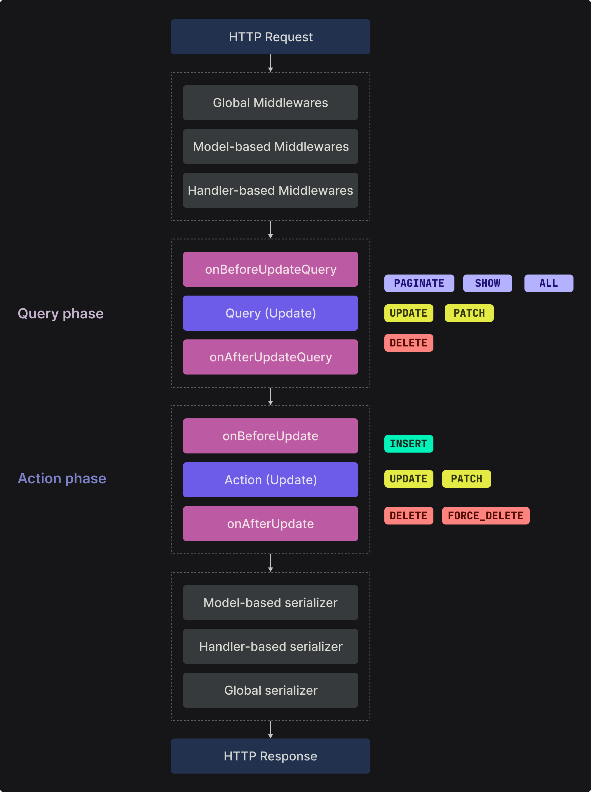

# Request-Response Cycle

In this section, we are going to talk about everything HTTP Request-Response cycle in Axe API.

<ul class="intro">
  <li>You will learn</li>
  <li>What is Request and Response?</li>
  <li>What is the Request-Response cycle?</li>
  <li>How does Axe API process the Request-Response cycle?</li>
</ul>

## Request & Response

In HTTP, a request is a client-initiated message sent to a server, specifying an action to be performed. It includes a method (e.g., GET, POST) and a target URL, optional headers, and sometimes a request body.

The server processes the request and generates a response. A response is the server's reply to the client's request, including an HTTP status code, headers, and often a response body containing requested data or an acknowledgment.

Requests and responses form the foundation of communication in the HTTP protocol, allowing clients to retrieve information, submit data, and interact with servers in a standardized and structured manner.

## Request-Response cycle

The Request-Response cycle in HTTP represents the flow of communication between a client and a server. It starts when the client sends an HTTP request to the server, specifying the desired action, URL, headers, and sometimes a request body.

The server receives the request, processes it, and generates an HTTP response. The response includes an HTTP status code, headers, and often a response body containing requested data or an acknowledgment.

When we talk about the Request-Response cycle in Axe API, we mean the process in that Axe API handles the request and generates a response process.

## Request-Response cycle flow

The following schema demonstrates the Axe API Request-Response cycle for updating a resource route: `PUT api/v1/users/1`

